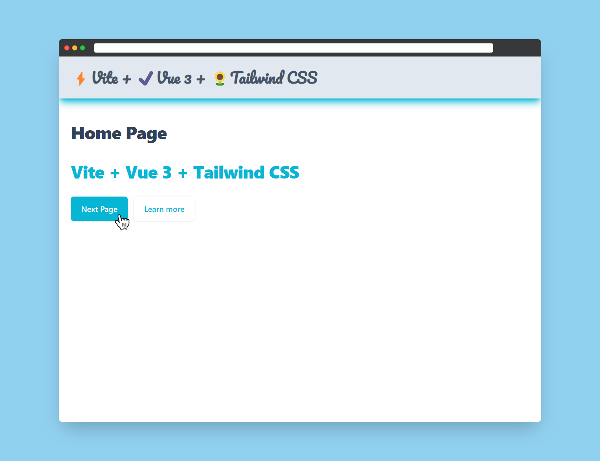
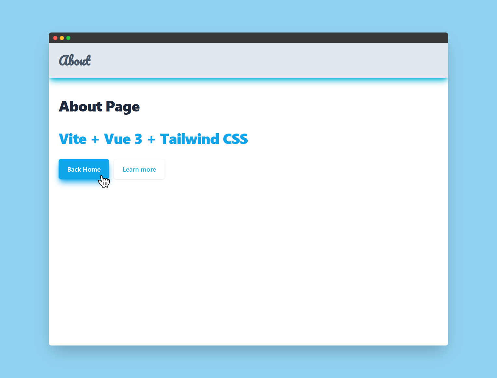
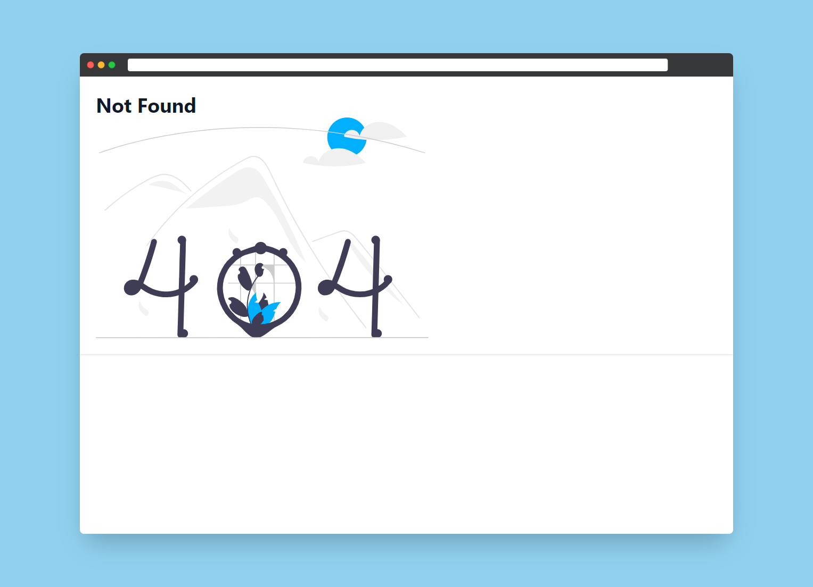

<!-- [![Contributors][contributors-shield]][contributors-url]
[![Stargazers][stars-shield]][stars-url] -->

<a href="https://github.com/swaubhik/vite-vue3-router4-tailwind-starter/stars"  rel="noopener noreferrer">
</a><a href="https://github.com/swaubhik/vite-vue3-router4-tailwind-starter/fork" rel="noopener noreferrer"></a>
<a href="https://github.com/swaubhik/vite-vue3-router4-tailwind-starter/blob/master/LICENSE" rel="noopener noreferrer"></a>
<a href="https://github.com/swaubhik/vite-vue3-router4-tailwind-starter/blob/master/issues"  rel="noopener noreferrer"></a>

<!--
[![LinkedIn][linkedin-shield]][linkedin-url] -->

<p align="center">
  <a href="https://vitejs.dev" target="_blank" rel="noopener noreferrer">
    
  </a>
  <a href="https://vuejs.org" target="_blank" rel="noopener noreferrer">
    
  </a>
  <a href="https://tailwindcss.com/" target="_blank">
    
  </a>
</p>

# ⚡ Vite + ✔️ Vue 3 + 🌻 Tailwind

This template should help get you started developing with Vue 3 in Vite using tailwind css. The template uses Vue 3 `<script setup>` SFCs, check out the [script setup docs](https://v3.vuejs.org/api/sfc-script-setup.html#sfc-script-setup) to learn more.

**This starter template includes:**

- [Vite](https://vitejs.dev/guide/)
- [Vue 3](https://vuejs.org/guide/introduction.html)
- [Tailwind CSS v3](https://tailwindcss.com/docs/configuration)
- [Vue Router v4](https://github.com/vuejs/router)
- [Headless UI](https://headlessui.dev/vue/menu) - unstyled, fully accessible UI components, designed to integrate beautifully with Tailwind CSS
- [Heroicons](https://github.com/tailwindlabs/heroicons#vue) - beautiful hand-crafted SVG icons,
  by the makers of Tailwind CSS

**First-party plugins needed for Tailwind UI:**

- [tailwindcss/forms](https://github.com/tailwindlabs/tailwindcss-forms)
- [tailwindcss/typography](https://tailwindcss.com/docs/typography-plugin)
- [tailwindcss/line-clamp](https://github.com/tailwindlabs/tailwindcss-line-clamp)
- [tailwindcss/aspect-ratio](https://github.com/tailwindlabs/tailwindcss-aspect-ratio)

## Screenshots
<p align="center">

</p>

## 🖥️ Recommended IDE Setup

- [VS Code](https://code.visualstudio.com/)
- [Volar](https://marketplace.visualstudio.com/items?itemName=Vue.volar)
- [Tailwind CSS IntelliSense](https://marketplace.visualstudio.com/items?itemName=bradlc.vscode-tailwindcss)

## ✏️ Authors

[@swaubhik](https://www.github.com/swaubhik)

## 🤝 Contributing

Contributions are always welcome!

See `contributing.md` for ways to get started.

Please adhere to this project's `code of conduct`.

If you have a suggestion that would make this better, please fork the repo and create a pull request. You can also simply open an issue with the tag "enhancement".
Don't forget to give the project a star! Thanks again!

1. Fork the Project
2. Create your Feature Branch `git checkout -b feature/AmazingFeature`
3. Commit your Changes `git commit -m 'Add some AmazingFeature'`
4. Push to the Branch `git push origin feature/AmazingFeature`
5. Open a Pull Request

## 🚀 Installation

Install my-project with npm

<!-- ```bash
  npm install my-project
  cd my-project
``` -->

## 💻 Tech Stack

**Client:** Vue, Vite, Vue-router, TailwindCSS

**Server:** Node

## 🤙 Support

For support, email swaubhik108@gmail.com

## 🚩 License

Distributed under the [MIT](https://github.com/swaubhik/vite-vue3-router4-tailwind-starter/blob/master/LICENSE) License. See `LICENSE.txt` for more information.
